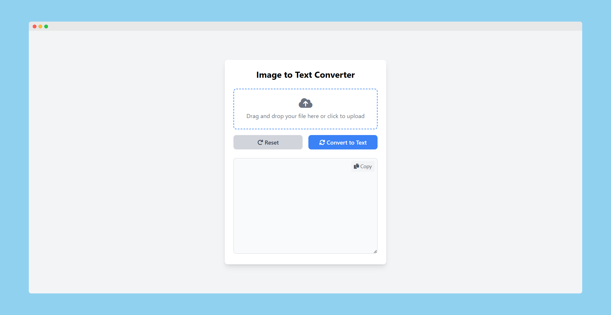

# 🚀Image to Text Converter
This is a self hostable Flask application that allows users to upload an image and extract text from it using Optical Character Recognition (OCR) via pytesseract. The extracted text is then displayed in a textarea on the page.



## Features
- Upload an image file (e.g., PNG, JPEG).
- Automatically extract text from the uploaded image using OCR.
- Display the extracted text in a textarea.

## Technologies Used
- Flask: A lightweight WSGI web application framework.
- Pillow: A Python Imaging Library (PIL) fork to handle image files.
- pytesseract: Python wrapper for Tesseract OCR to perform the text extraction.

## Getting Started
### Prerequisites
1. Python (3.x recommended)

2. Tesseract OCR: Install Tesseract OCR engine:
- For Ubuntu: sudo apt install tesseract-ocr
- For Windows: [Download Tesseract OCR](https://github.com/UB-Mannheim/tesseract/wiki)


## Installation
1. Clone the repository:
```bash
git clone https://github.com/tshenolo/image-to-text-converter.git
cd image-to-text-converter
```

2. Create a virtual environment:
```bash
python3 -m venv venv
```

3. Activate the virtual environment:
- On Windows:
```bash
venv\Scripts\activate
```

- On macOS/Linux:
```bash
source venv/bin/activate
```

4. Install the required Python packages:
```bash
pip install -r requirements.txt
```

5. Run the Flask app:
```bash
python app.py
```

6. Access the application: Open a web browser and go to http://127.0.0.1:5000 to use the Image to Text Converter.

## Deactivating the Virtual Environment
When you're finished, you can deactivate the virtual environment with:
```bash
deactivate
```


## Dockerizing the Application
You can use Docker to containerize the application, making it easy to deploy and run consistently across different environments.

### Building and Running the Docker Container

1. Build the Docker image:
```bash
docker build -t image-to-text-converter .
```

2. Run the Docker container:
```bash
docker run -d -p 5000:5000 --name image-to-text-converter image-to-text-converter
```

3. Open a web browser and go to http://localhost:5000 to access the app.

## Suggested Folder Structure
```
image-to-text-converter/
│
├── app.py                   # Main Flask application
├── README.md                # Project documentation
├── Dockerfile               # Docker configuration file
├── requirements.txt         # Project dependencies
├── uploads/                 # Folder to temporarily store uploaded images
│
└── templates/
    └── index.html           # HTML template for the main page
```

## Usage
1. Go to the main page of the app.
2. Upload an image using the file input.
3. Click the "Convert to Text" button.
4. The extracted text will be displayed in the textarea below.

## Troubleshooting
### Tesseract Not Found
If you receive an error related to Tesseract, ensure that it is installed and accessible in your system's PATH.

For Windows users, you may need to specify the Tesseract executable path in app.py:
```bash
pytesseract.pytesseract.tesseract_cmd = r'C:\Program Files\Tesseract-OCR\tesseract.exe'
```

## Contribute
If you want to contribute to this project, follow these steps:

- Fork the repository.  
- Create a new branch for your feature or bugfix.  
- Make your changes and commit them.  
- Push your changes to your fork.  
- Open a pull request.  

## License
This project is open source and available under the MIT License.


